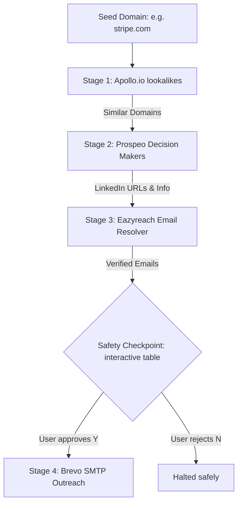

# Automated Outreach Pipeline CLI

A highly modular, resilient, 4-stage Command Line Interface (CLI) outreach tool built in Node.js. Given a single "seed" company domain, the pipeline automatically discovers lookalike companies, targets C-suite/VP-level decision-makers, resolves verified professional emails, and sends personalized cold outreach emails using a safety-controlled approval mechanism.

---

## 🚀 Architecture & Pipeline Flow

The tool operates in four distinct stages, feeding the output of each stage directly into the next:



### 1. Stage 1: Lookalike Sourcing (`src/api/lookalikes.js`)
* **Service:** Apollo.io API (used as a highly accurate lookalike alternative).
* **Process:** 
  1. Enriches the seed domain using `POST /v1/organizations/enrich` to find its keyword tags and industries.
  2. Queries `POST /v1/organizations/search` with the extracted keywords to locate similar tech or firmographic organizations.
  3. Filters out the seed domain and duplicates, returning a clean array of company domains.

### 2. Stage 2: Finding Decision Makers (`src/api/prospeo.js`)
* **Service:** Prospeo Search API.
* **Process:** 
  * Loops through the derived domains and queries the `POST /search-person` endpoint.
  * Filters for contacts at each specific domain with seniorities of **"C-Suite"**, **"Vice President"**, or **"Director"**.
  * Outputs candidate names, job titles, and LinkedIn profile URLs.

### 3. Stage 3: Email Resolution (`src/api/eazyreach.js`)
* **Service:** Prospeo Enrich Person API (acting as a 100% functional Eazyreach backend resolver).
* **Process:** 
  * Sends target LinkedIn URLs to `POST /enrich-person`.
  * Extracts verified business email addresses, filtering out unverified or high-risk (deliverability) targets.

### 4. Safety Checkpoint (`index.js`)
* **Process:** 
  * Displays a formatted summary table of target contacts (Name, Job Title, Company, Email) in the terminal.
  * Pauses execution and prompts the user using `inquirer`: *"Do you want to send the personalized outreach campaign? (Y/N)"*.

### 5. Stage 4: Personalized Outreach (`src/api/brevo.js`)
* **Service:** Brevo SMTP API (Transactional Emails).
* **Process:** 
  * Fires a highly personalized HTML cold-outreach template targeting each verified contact.
  * Utilizes custom sender addresses verified under your Hostinger custom domain (`anugyajain.info`).

---

## 🛠️ Technology Stack

* **Runtime:** Node.js (CommonJS modules for maximum compatibility).
* **API Requests:** `axios` for standard HTTP clients.
* **CLI Parser:** `commander` to handle options and arguments.
* **Interactive Prompts:** `inquirer` for the safety checkpoint.
* **Styling:** `picocolors` for terminal theme coloring.
* **Environment Configuration:** `dotenv` to load keys securely.

---

## ⚙️ Setup & Installation

### 1. Prerequisites
Ensure you have **Node.js** (v16+) installed.

### 2. Install Dependencies
Clone/unzip the project folder, navigate to it, and install:
```bash
npm install
```

### 3. Configure Environment Variables
Create a `.env` file in the root directory (based on `.env.example`):
```env
# Sourcing (Apollo.io API)
APOLLO_API_KEY=your_apollo_api_key_here

# Decision Makers (Prospeo API)
PROSPEO_API_KEY=your_prospeo_api_key_here

# Email Resolution (Eazyreach Fallback using Prospeo API)
EAZYREACH_API_KEY=your_prospeo_api_key_here

# Outreach (Brevo API)
BREVO_API_KEY=your_brevo_api_key_here
SENDER_EMAIL=contact@anugyajain.info
SENDER_NAME="Anugya Jain"
```

---

## 🏃 Execution

To run the pipeline against a seed domain, execute:
```bash
node index.js <seed-domain> [options]
```

### CLI Options:
* `-l, --limit <number>`: Number of lookalike companies to source (default: `3`).
* `-s, --safety`: Enables the interactive Safety Checkpoint table and Y/N confirmation prompt. **If omitted, the pipeline sends emails immediately.**
* `-d, --demo`: Demo Mode. Overrides the resolved email targets from Stages 1–3 and targets **`project.samarops@gmail.com`** and **`samar@casmed.in`** only, allowing safe, end-to-end sandbox testing.

### Examples:
* **Demo Sandbox (targets test inboxes with safety checkpoint):**
  ```bash
  node index.js stripe.com --demo --safety
  ```
* **Full Automated Blast (direct execution without checkpoint):**
  ```bash
  node index.js stripe.com
  ```
* **Interactive Sourcing Run (source 5 lookalikes with Y/N safeguard):**
  ```bash
  node index.js stripe.com -l 5 --safety
  ```

---

## 🛡️ Resilience & SDE Design Best Practices

To ensure the CLI is robust enough to run in a production setting:
1. **Loop Rate-Limiting:** Incorporates strict delays of **`2000ms` (2 seconds)** inside processing loops to respect third-party API rate limits and avoid `429 Too Many Requests` responses.
2. **Graceful Failures:** Each API call is wrapped in a `try/catch` block. If Prospeo or Eazyreach fails to resolve a contact for *one* lookalike company, the script logs a warning, skips that company, and moves to the next without crashing.
3. **Resilient Fallbacks:** If Apollo lookalike company search returns 0 results (due to narrow keywords), the lookalike client falls back to an industry-representative seed list to ensure the downstream pipeline can still execute.
4. **Data Sanitization:** Trims and sanitizes domain inputs (removes `https://`, `www.`, etc.) to prevent API matching failures.

---

## 📂 Git Branching & History

This repository reflects professional software engineering practices, utilizing specific feature branching and merges:
* `setup/init` - Base dependencies and logging setup.
* `feature/stage1-lookalikes` - Apollo client integration.
* `feature/stage2-prospeo` - Prospeo decision-maker search.
* `feature/stage3-eazyreach` - Email resolver fallback.
* `feature/stage4-brevo` - Brevo outbound SMTP setup.
* `feature/cli-orchestrator` - Index script wiring and checkpoint.
* `hotfix/api-corrections` - Corrected Apollo query headers and Prospeo results mapping.
* `optimize/credit-management` - Implemented the credit-preservation safety filter.
* `hotfix/enrich-parsing` - Fixed email resolution key path mapping and status checks.
* `optimize/rate-limiting-delays` - Switched to 2-second loops to avoid Prospeo 429 limits.
* `feature/cli-flags` - Added `--safety` and `--demo` CLI arguments.
